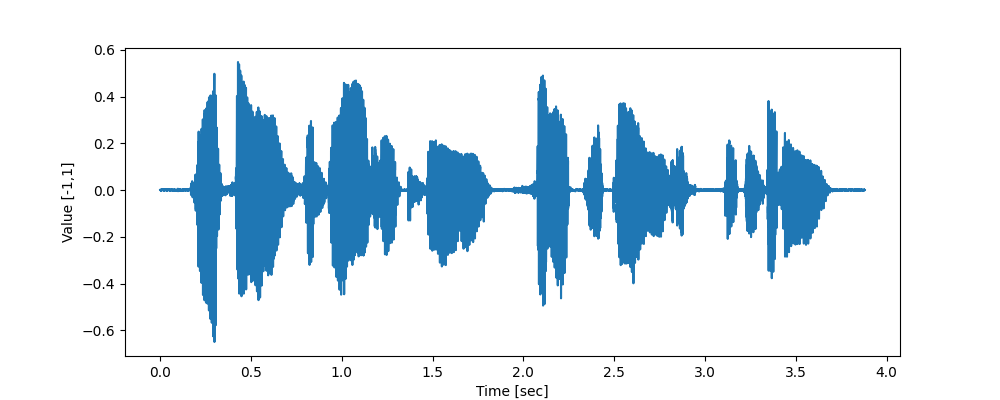
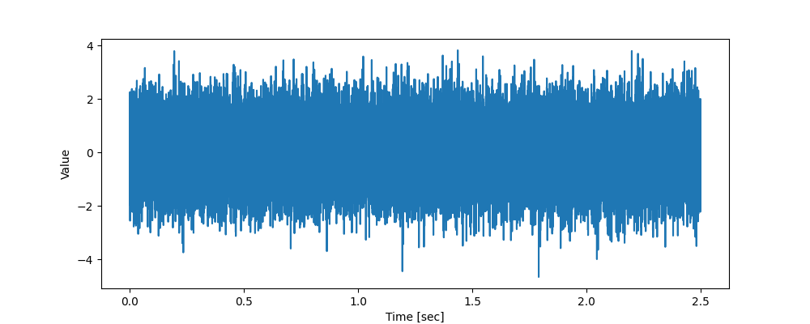
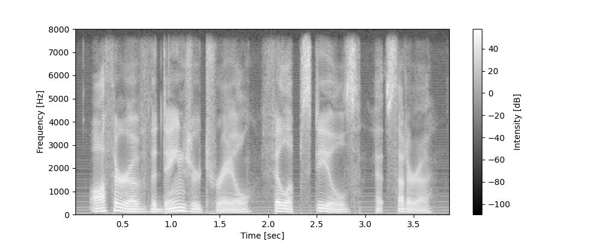
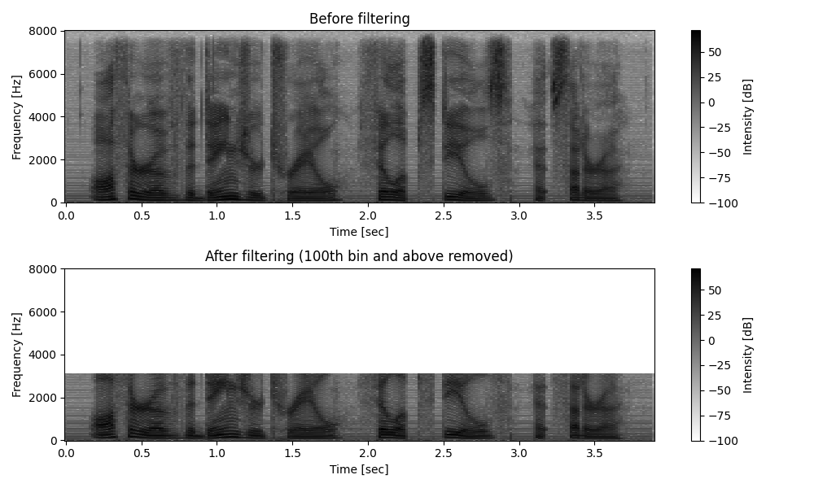
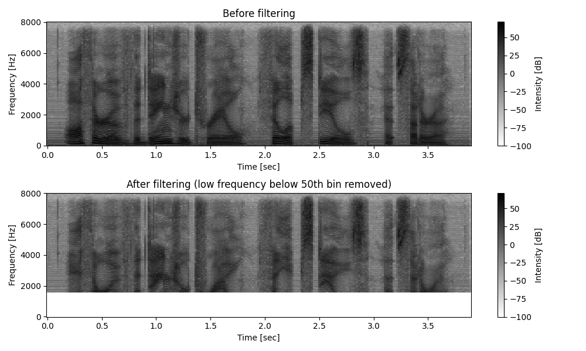

# 第2章

## 目次
- [第2章](#第2章)
  - [目次](#目次)
  - [音声ファイルを聞いてみる](#音声ファイルを聞いてみる)
  - [時間周波数領域への変換](#時間周波数領域への変換)
    - [波形の構成要素](#波形の構成要素)
    - [サンプリングとナイキスト定理](#サンプリングとナイキスト定理)
    - [短時間フーリエ変換（STFT）](#短時間フーリエ変換stft)
      - [窓関数](#窓関数)
        - [ハニング窓](#ハニング窓)
        - [ハミング窓](#ハミング窓)
        - [長方形窓](#長方形窓)
      - [フレームの切り出し式](#フレームの切り出し式)
      - [STFT の計算式](#stft-の計算式)
    - [スペクトログラムの可視化](#スペクトログラムの可視化)
  - [音声を時間領域の信号に戻す](#音声を時間領域の信号に戻す)
    - [逆短時間フーリエ変換（iSTFT）](#逆短時間フーリエ変換istft)
  - [時間周波数領域での音声の加工](#時間周波数領域での音声の加工)
    - [特定の周波数を消す](#特定の周波数を消す)
    - [雑音除去](#雑音除去)
      - [スペクトルサブトラクション](#スペクトルサブトラクション)
      - [ウィナーフィルタ](#ウィナーフィルタ)

## 音声ファイルを聞いてみる

[2-1.py](../section2/2-1.py)でデータセットのダウンロードとファイル情報の確認が出来る。

[2-2.py](../section2/2-2.py)は、`matplotlib`を利用して音声データをプロットするコードである。



見ればわかるように、信号の統計的性質が時間ごとに大きく変化する信号を**非定常な信号**と呼ぶ。反対に、**定常な信号**のれいは白色雑音である。

白色雑音を生成するコードを[2-3.py](../section2/2-3.py)に示す。



さきほどの音声データと比較して、時間に寄らず音量がおおむね一定であることがわかる。

## 時間周波数領域への変換

### 波形の構成要素

音声信号（波形）は、**正弦波（サイン波）の重ね合わせ**として表現できる（フーリエの定理）。
どんなに複雑な波形も、次の3つの要素を持つ正弦波の組み合わせで完全に記述できる。

| 要素 | 説明 | 例 |
|------|------|----|
| **周波数** | 1秒間に波が繰り返す回数。単位はHz | 440Hz → ラの音（A4） |
| **振幅** | 波の大きさ。音量に相当する | 大きいほど音が大きい |
| **位相** | 波の時間方向のズレ（0〜2π） | 同じ音でも波のスタート位置が異なる |

音声信号 $x(t)$ は次のように表せる：

$$x(t) = A\sin(2\pi f t + \phi)$$

- $A$：振幅
- $f$：周波数 [Hz]
- $\phi$：初期位相 [rad]

**フーリエ変換**を使うと、この分解を自動的に行い、複雑な波形をどの周波数がどれだけ含まれているかという情報（周波数スペクトル）に変換できる。

```
時間領域（波形）  ──フーリエ変換──→  周波数領域（スペクトル）
x(t)                                  X(f) ← 各周波数の振幅・位相
```

### サンプリングとナイキスト定理

自然界の音は**連続的なアナログ信号**だが、コンピュータが扱えるのは**離散的なデジタルデータ**のみ。
そのため、一定時間ごとに音の振幅を測定して数値化する。この操作を**サンプリング（標本化）**と呼ぶ。

**サンプリング周波数（fs）**：1秒間に何回サンプリングするかを表す数値。単位はHz。
**サンプリング周波数 $f_s$ で正しく復元できる音の最大周波数は $f_s / 2$ まで**

この $f_s / 2$ を**ナイキスト周波数**と呼ぶ。

**具体例：** サンプリング周波数 $f_s = 16{,}000$ Hz の場合
- ナイキスト周波数 = **8,000 Hz**
- 8,000 Hz 以下の音 → 正しく復元できる ✓
- 8,000 Hz を超える音 → 正しく復元できない → **エイリアシング（折り返し歪み）**が発生

ナイキスト周波数を超える周波数成分がサンプリング前に混入していると、それが低い周波数の信号として**誤って復元**されてしまう。この歪みは一度発生すると取り除くことができない。

それに対する対策方法が**ローパスフィルタ**である。
録音時に、サンプリングの前段階で**ローパスフィルタ（LPF）**を通し、ナイキスト周波数以上の成分を除去する。

```
マイク → [LPF（ナイキスト周波数以下のみ通過）] → [ADC（サンプリング）] → デジタルデータ
```

こうすることで、ナイキスト周波数以下のすべての周波数成分について、元の連続的な音声波形を正確に復元することが保証される。

### 短時間フーリエ変換（STFT）

音声全体をまとめてフーリエ変換すると、**どの周波数がいつ現れたか**という時間情報が失われてしまう。

```
全体フーリエ変換：「この音声に 1000Hz が含まれている」← いつかは不明
STFT：           「2.3秒〜2.4秒の区間に 1000Hz が強く現れている」← 時間が分かる
```

STFTでは音声を短い区間（**フレーム**）に区切り、各フレームに個別にフーリエ変換を適用する。フレーム分割のパラメータは以下の通り。

| パラメータ | 説明 | 典型的な値 |
|-----------|------|----------|
| **フレームサイズ N** | 1フレームのサンプル数 | 512（約32ms @ 16kHz） |
| **フレームシフト $L_{shift}$** | フレームをずらす量（サンプル数） | 256（= N/2） |
| **オーバーラップ長** | フレーム間の重複サンプル数 | N − $L_{shift}$ = 256 |

**オーバーラップを設ける理由：**
オーバーラップなしでは、フレームの境界付近の情報が失われやすい。少しずつずらすことで振幅変化を連続的・滑らかに捉えられる。

**オーバーラップを大きくしすぎない理由：**
オーバーラップを増やすほどフレーム数が増え、計算コストと処理時間が増大する。

#### 窓関数

フレームを切り出す際、そのままだとフレームの端で信号が急激に切断され、**スペクトル漏れ**（本来存在しない周波数成分が現れる現象）が発生する。
これを抑えるために、フレームに**窓関数**を乗算する。窓関数はフレームの両端を滑らかにゼロに近づける形をしている。

##### ハニング窓

$$w(n) = 0.5 - 0.5\cos\!\left(\frac{2\pi n}{N-1}\right), \quad n = 0, 1, \ldots, N-1$$

両端がゼロになる滑らかな山形。スペクトル漏れの抑制に優れる。

##### ハミング窓

$$w(n) = 0.54 - 0.46\cos\!\left(\frac{2\pi n}{N-1}\right), \quad n = 0, 1, \ldots, N-1$$

ハニング窓に似ているが、両端がゼロにならない（≈ 0.08）。係数が微妙に異なる。

##### 長方形窓

$$w(n) = 1, \quad n = 0, 1, \ldots, N-1$$

窓関数をかけない場合と等価。スペクトル漏れが最も大きい。

#### フレームの切り出し式

$l$ 番目のフレーム（フレームインデックス）の $n$ 番目のサンプルは：

$$x'(l, n) = w(n) \cdot x(l \times L_{shift} + n)$$

- $x$：元の音声波形
- $w(n)$：窓関数
- $L_{shift}$：フレームシフト（何サンプルずつずらすか）

#### STFT の計算式

窓をかけたフレーム $x'(l, n)$ に対して離散フーリエ変換（DFT）を適用する。

$$y(l, k) = \sum_{n=0}^{N-1} x'(l, n) \exp\!\left(-j\frac{2\pi nk}{N}\right)$$

- $l$：フレームインデックス（時間方向）
- $k$：周波数インデックス（$k = 0, 1, \ldots, N/2$）
- $y(l, k)$：時刻 $l$・周波数 $k$ における複素スペクトル

出力 $y(l, k)$ は**複素数**であり、絶対値が振幅・偏角が位相を表す。
[2-8.py](../section2/2-8.py)に`scipy`によるSTFTの実行コードが掛れている。

STFTの出力は**複素数**なので、複素数の扱いを理解しておく必要がある。[2-7.py](../section2/2-7.py)にコードがある

**複素数で振幅と位相を表す：**

複素数 $z = a + bj$ は**極形式**で次のように表せる：

$$z = |z| \cdot e^{j\phi} = |z|(\cos\phi + j\sin\phi)$$

- $|z| = \sqrt{a^2 + b^2}$：振幅（絶対値）
- $\phi = \arctan(b/a)$：位相角

STFTの出力 $y(l, k)$ はこの形の複素数であり、**絶対値が振幅スペクトル、偏角が位相スペクトル**に対応する。

$$y(l,k) = |y(l,k)| \cdot e^{j\phi(y(l,k))}$$

### スペクトログラムの可視化

スペクトログラムは STFT の**振幅の二乗（パワー）**を時間×周波数の2次元画像として表示したもの。

[2-9.py](../section2/2-9.py)では、matplotlibの`specgram`関数を使ってスペクトログラムを可視化している。`specgram`では関数内で短時間フーリエ変換を行っている。また、`NFFT`でフレームサイズを指定し、`noverlap`でオーバーラップ長を指定している。

スペクトログラムを表示する際の各時間・周波数の成分の強さは**デシベル**という単位を取っている。これは以下の数式で表される。

$$
20\log{|x_{lk}|}
$$

[2-9.py](../section2/2-9.py)を実行した結果を以下に示す。



横軸は時間、縦軸は周波数、色は強度（dB）を示している。

- 明るい部分 → その時刻・周波数にパワーが集中している
- 横縞 → 特定の周波数が持続している（母音など）
- 縦縞 → 短時間で多くの周波数が出現している（破裂音など）

## 音声を時間領域の信号に戻す

### 逆短時間フーリエ変換（iSTFT）

STFTで時間周波数領域に変換した信号を、元の時間領域（波形）に戻す操作。
音源分離では、**周波数領域で処理した結果を最終的に波形に戻す**ために必ず使用する。

```
元の波形 →[STFT]→ 複素スペクトル →[処理]→ 処理済みスペクトル →[iSTFT]→ 処理済み波形
```

$$
y'(l,n)=\frac{1}{N}\Sigma{N-1}{k=0}y(l,k)\exp{(j\frac{2\pi nk}{N})}
$$

この信号はフレームシフト幅$L_{shift}$に依存して、フレーム方向にデータが重なっている。データの重なりを取るために、**重畳加算**という処理を施す。

`Numpy`や`Scipy`では`istft`という関数を使って、時間周波数領域の信号を時間領域の信号に戻すことができる。コードは[2-10.py](../section2/2-10.py)に示されている。

`istft`は重畳加算についても内部で実行している。したがって窓関数を引数として与えている。なお、窓関数についてはstftで与えたものと同一のものが望ましい。返り値は、1つ目が**時間軸の情報**で、2つ目が**時間領域の音声信号**となっている。

## 時間周波数領域での音声の加工

ここで、**時間周波数領域の音声波形を加工してから時間領域に戻す**ことを考える。

### 特定の周波数を消す

短時間フーリエ変換後の信号$x(l,k)$について、特定の周波数よりも高い周波数成分をすべて消してみる。これを逆フーリエ変換して、その音を聞いてみることにする。[2-11.py](../section2/2-11.py)を実行する。



高周波成分を除去することで、**こもった・低音だけの音声**になることがわかる。

続いて、低周波成分を消してみることにする。コードは[2-12.py](../section2/2-12.py)。



低周波成分を除去することで、**軽い・乾いた音声**になることがわかる。

### 雑音除去

次に、背景に存在する雑音を消すことを考えてみる。ここでは**スペクトルサブトラクション**と**ウィナーフィルタ**という2つの手法について考える。

問題設定としては以下の通り。

観測信号（マイクで録音した信号）= 音声 + 雑音。雑音だけが含まれる区間を使って雑音の特性を推定し、音声を取り出す。

```
mix_signal = speech_signal + wgn_signal
```

コードでは冒頭に雑音のみの区間（40,000サンプル = 2.5秒分）を設け、そこで雑音スペクトルを推定する。

#### スペクトルサブトラクション

#### ウィナーフィルタ